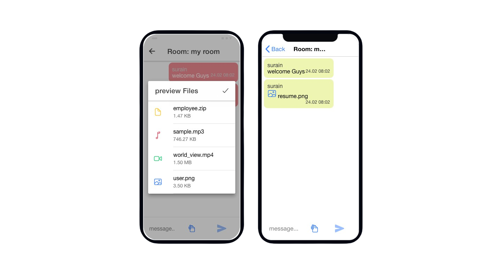

# chat-app-with-file-sharing
<blockquote> ionic_angular chat app using express,mongodb Atlas, socket.io & mongoose  </blockquote>

<h1>chat Room<h1>

<h3>Requirements</h3>  

- Install Node js </a>  </a>

- Ionic client 
<pre><code>$ npm install -g @ionic/cli</code></pre>

- Nodemon

<pre><code>$ npm install -g nodemon</code></pre>

<h3>Installing Steps:</h3>

 - download file
 - create <b> mychat folder </b> & paste the downloading files <b>inside</b> the folder.
 - open command prompt or terminal.
 - install dependency so enter command 
 <pre><code>$ cd mychat</code></pre>
 
 <pre><code>$ npm install</code></pre>
<b>Next</b>
 - install express dependencies
 <pre><code>$ cd backend</code></pre>
 
<pre><code>$ npm install</code></pre>

- Then create mongodb atlas account & and create your own database.
  more infromation <link> https://docs.atlas.mongodb.com/connect-to-cluster/ </link>

- Open <b> db.js </b>(mychat/backend/database/db.js) file on your code editor and paste the your mongoDb atlas cluster link on the file.
- finally save the file.
- first start your express server so goto <b>backend</b> folder directory.
- run following command in command prompt or terminal
 <pre><code>$ nodemon serve</code></pre>
 
 - open another command prompt or terminal(don't close previous command prompt or terminal)
 - start ionic app so go to <b> mychat</b> folder directory in command prompt
 - - run following command in command prompt or terminal
 <pre><code>$ ionic serve</code></pre>
 
- That's all your ionic chat app is successfully build....
